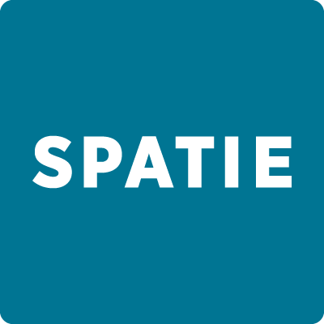

<h1 >Chad Movie Quotes Api</h1>

---
Movie Quotes - is a platform where users can register first, then login and browse movie quotes.

#
### Table of Contents
* [Prerequisites](#prerequisites)
* [Tech Stack](#tech-stack)
* [Getting Started](#getting-started)
* [Migrations](#migration)
* [Development](#development)
* [Database structure](#drawsql)

#
### Prerequisites

*  *PHP@8.1.5 and up*
*  *MYSQL@8.0.29 and up*
*  *npm@8.10.0 and up*
*  *composer@2.3.5 and up*


#
### Tech Stack

*  [Laravel@9.12.2.x](https://laravel.com/docs/9.x) - back-end framework
*  [Spatie Translatable](https://github.com/spatie/laravel-translatable) - package for translation

#
### Getting Started
1\. First of all you need to clone Chad Movie Quotes Api from github:
```sh
git clone https://github.com/RedberryInternship/Chad-movie-quotes-back-Luka-Kurdadze.git
```

2\. Next step requires you to run *composer install* in order to install all the dependencies.
```sh
composer install
```

3\. after you have installed all the PHP dependencies, it's time to install all the JS dependencies:
```sh
npm install
```

and also:
```sh
npm run dev
```
in order to build your JS/SaaS resources.

4\. Now we need to set our env file. Go to the root of your project and execute this command.
```sh
cp .env.example .env
```
And now you should provide **.env** file all the necessary environment variables:

#
**MYSQL:**
>DB_CONNECTION=mysql

>DB_HOST=127.0.0.1

>DB_PORT=3306

>DB_DATABASE=*****

>DB_USERNAME=*****

>DB_PASSWORD=*****


#
**GMAIL SMTP:**
>MAIL_MAILER=smtp

>MAIL_HOST=smtp.gmail.com
 
>MAIL_PORT=465

>MAIL_USERNAME=YOUR_EMAIL

>MAIL_PASSWORD=YOUR_EMAIL_PASSWORD

after setting up **.env** file, execute:
```sh
php artisan config:cache
```
in order to cache environment variables.

4\. Now execute in the root of you project following:
```sh
  php artisan key:generate
```
Which generates auth key.

##### Now, you should be good to go!


#
### Migration
if you've completed getting started section, then migrating database if fairly simple process, just execute:
```sh
php artisan migrate
```
### Get Data In Database
You need to run command in terminal to fetch data from api and add it to database
```sh
php artisan get:covid-data
```

### Development

You can run Laravel's built-in development server by executing:

```sh
  php artisan serve
```

when working on JS you may run:

```sh
  npm run dev
```
it builds your js files into executable scripts.
If you want to watch files during development, execute instead:

```sh
  npm run watch
```
it will watch JS files and on change it'll rebuild them, so you don't have to manually build them.


### Drawsql

you can see database structure here

[](https://drawsql.app/laravel-10/diagrams/coronatime)

